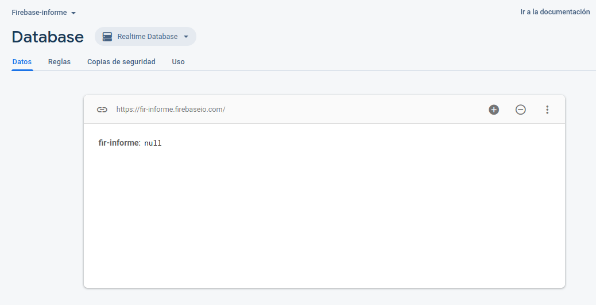
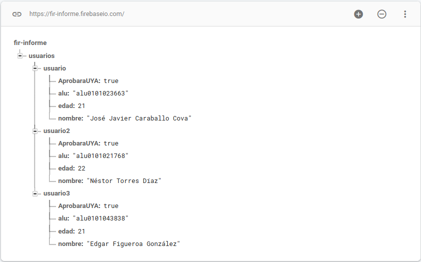
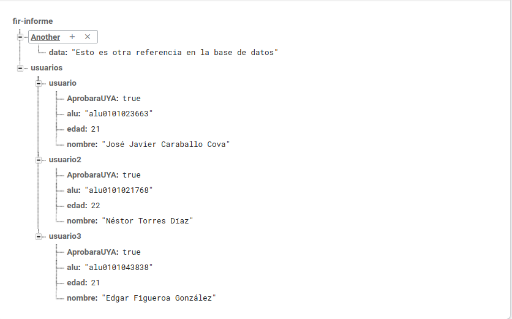

## Informe práctica introducción a Firebase
*Autores:* Grupo 10
- Néstor Torres Díaz
- Edgar Figueroa González
- José Javier Caraballo Cova

En esta práctica hemos tenido un primer contacto con firebase. Primero hemos creado un proyecto en la siguiente web [firebase](https://firebase.google.com/) al cual posteriormente hemos añadido una base de datos.

Todo el código de como acceder a la base de datos se encuentra en `src/js/index.js`.

Aspecto de la base de datos antes de insertar información en ella.  

Base de datos con información insertada.  

Otra entrada completamente distinta en la base de datos.

