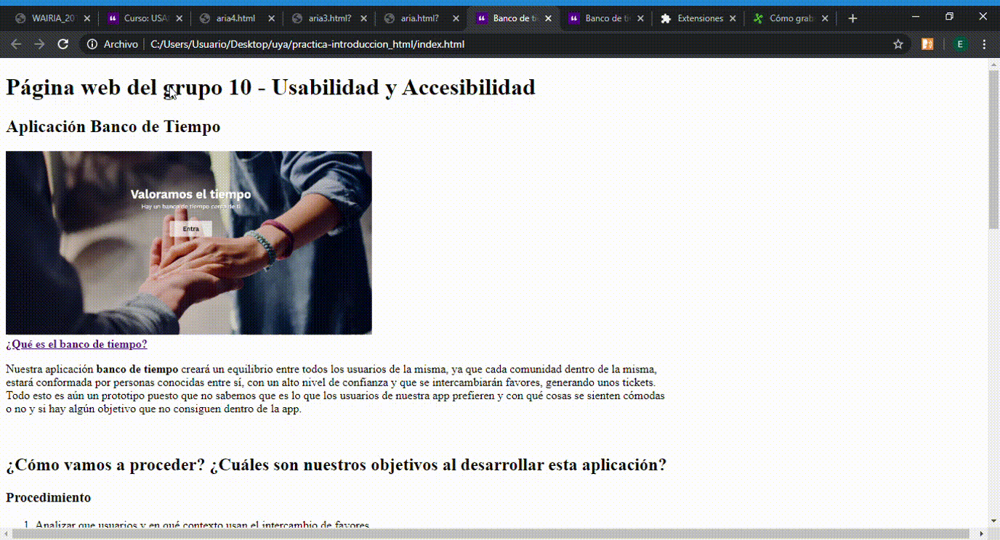
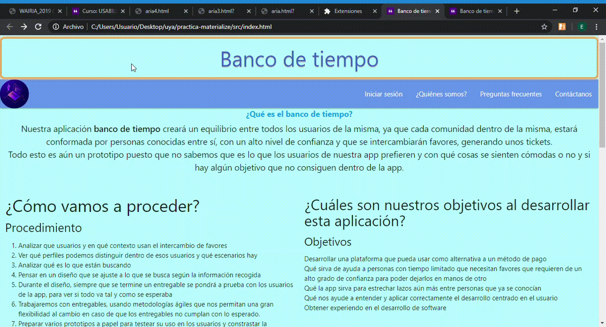

## Práctica WAI-Aria

**Grupo 10 - Miembros del grupo:**

- *Néstor Torres Díaz*

- *Edgar Figueroa González*

- *José Javier Caraballo Cova*

### Elementos añadidos

En esta práctica lo que hemos hecho ha sido añadir elementos de WAI-Aria para intentar mejorar la accesibilidad de los sitios web que hemos creado. Principalmente hemos añadido el atributo `tabindex="0"` para agregar elementos al orden de tabulación y que por lo tanto se pueda navegar por toda la página. También hemos añadido distintos atributos como los roles, aria-required y aria-label. También hemos añadido `<label>` a cada campo `input`. En nuestro caso, no hemos tenido que añadir muchos de estos últimos puesto que cuando creamos las páginas web tuvimos este punto en mente.

### Práctica HTML antes y después de añadir WaiAria

- Antes de añadir WAI-Aria:

- Después de añadir WAI-Aria:

### Práctica Materialize antes y después de añadir WaiAria

- Antes de añadir WAI-Aria:

- Después de añadir WAI-Aria:

