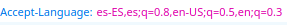
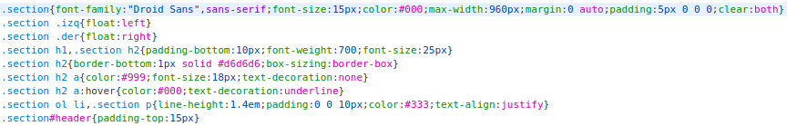
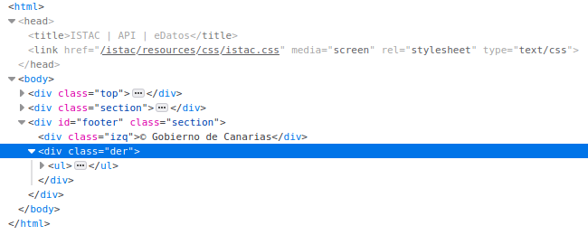
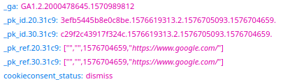
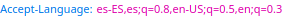
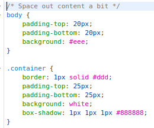
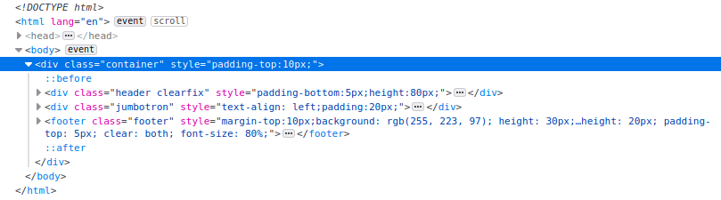

# Informe seminario HTTP

*Cuestiones sobre *

* **Qué peticiones desencadena la consulta.** 
 
Desencadena peticiones de tipo GET con códigos 200 , 302 , 304. 
 Teniendo en cuenta que las que son de la forma 2XX representan un código de retorno correcto y las de la forma 3XX representan un código de rotorno de redirección.

* **¿Qué tipo de petición estás realizando?**

 Todas las peticiones que se realizan son del tipo GET.  

* **Qué código de estatus devuelve.** 

Devuelve los códigos: 200 , 302 , 304 y 404.  

* **Qué DNS tiene el servidor**

http://www.gobiernodecanarias.org/istac/api/

* **Qué IP tiene tiene el servidor** 

El servidor tiene IP 93.188.137.123:80

* **¿La página tiene alguna cookie? ¿Cuáles?**   

No tiene cookies.

* **¿Qué idioma acepta?**   

* **Alguna línea de código JavaScript**  

En esta página web no hay elementos Javascript.

* **Alguna línea de código CSS que se aplique**

* **Alguna línea de código HTML que se aplique.**    

*Cuestiones sobre *

* **Qué peticiones desencadena la consulta.** 

* **¿Qué tipo de petición estás realizando?**  

Todas las peticiones son de tipo GET.

* **Qué código de estatus devuelve.**  

Devuelven códigos 304 , 404 y 200.

* **Qué DNS tiene el servidor**

http://www3.gobiernodecanarias.org/sanidad/scs/gc/18/Cita_Previa/index.html

* **Qué IP tiene tiene el servidor**   

Tiene ip 93.188.136.126:80

* **¿La página tiene alguna cookie?, ¿Cuáles?.**   
Sí la página tiene cookies.
  
* **¿Qué idioma acepta?**    

* **Alguna línea de código JavaScript**  
* **Alguna línea de código CSS que se aplique**  

* **Alguna línea de código HTML que se aplique.**   
